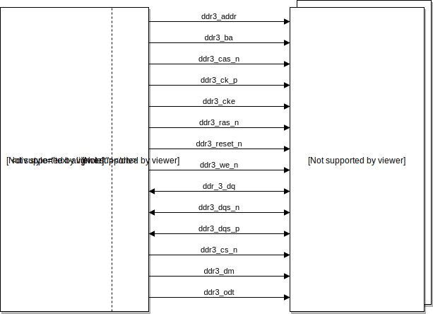

# DDR SDRAM Controller for Digilent Boards

We provide a memory controller that works alongside Xilinx Memory Interface Generator (MIG). We also provide UCF files and instructions to easily integrate DDR SDRAM on the following Digilent Boards:

* Genesys 2
* Nexys Video
* :construction: Nexys DDR :construction:

For more information visit the project [wiki](https://github.com/alonsorb/ddr-ram-controller-mig/wiki/Home)

### Overview

#### User Interface Signals

#### DDR SDRAM Physical Signals

### Authors

* Alonso Rodriguez - alonso.rodriguez.13@sansano.usm.cl
* Rodrigo Venegas - rodrigo.venegas.13@sansano.usm.cl
